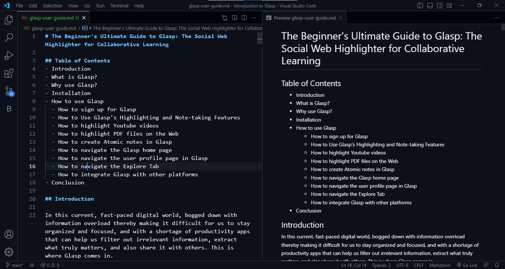

# TWMP Cohort 2 second task
This my second task for the Technical Writing Mentorship Program organized by Wisdom Nwokocha. 
In this task, we are to write an article covering everything about [Glasp](http://www.glasp.co) and how to use it.  

This article is to obey the following rules.
- Arrange the order of the content.
- Attention to details 
- Work on the information architecture
- It should be over 1000 words
- No plagiarism 
- Don’t use AI-generated content
- Your audience is a novice
- Proper citation 
- No grammatical or spelling error 
- No repetitive and filler words 
- Must have necessary images 
- Use the Google Writing style guide
  

Below contains a screenshot of my assignment on vscode.

