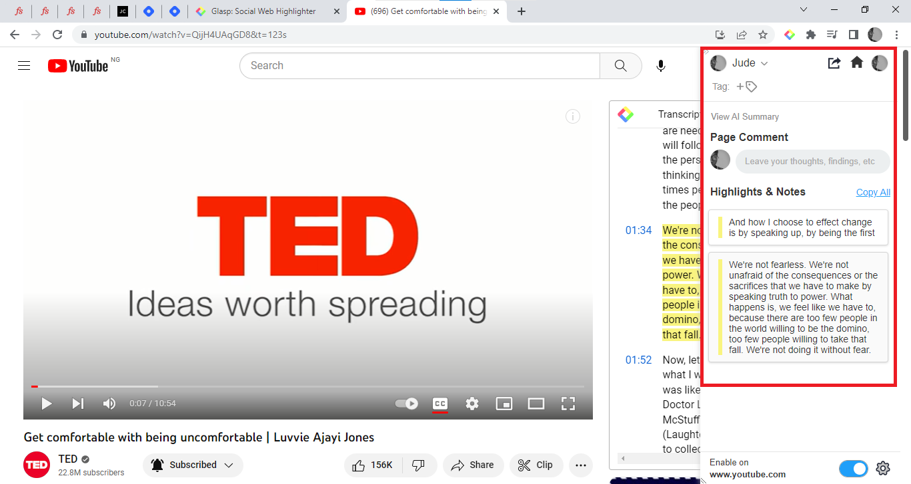
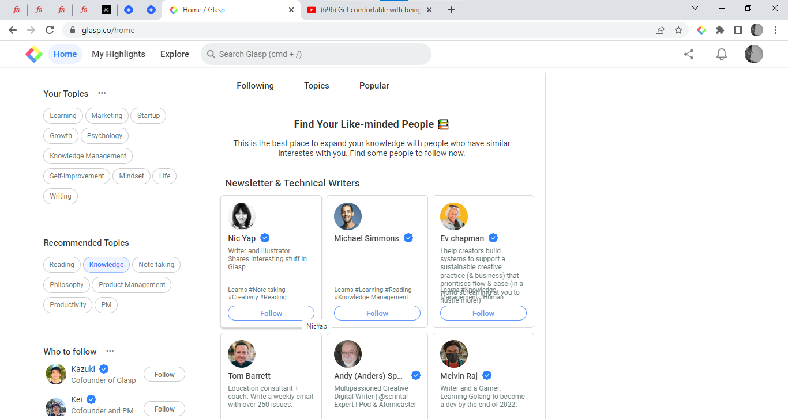
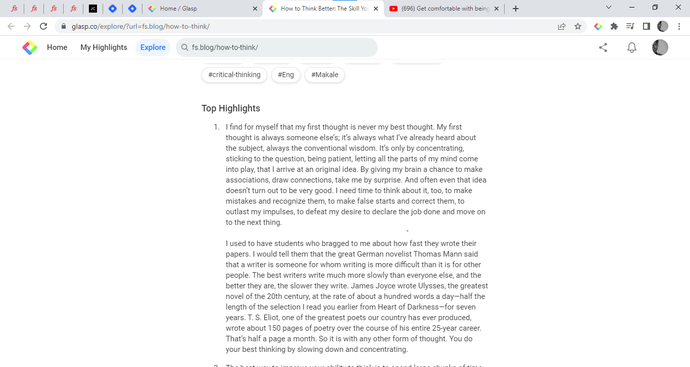

# The Beginner's Guide to Glasp: The Social Web Highlighter for Collaborative Learning

## Table of Contents
- Introduction
- What is Glasp?
- Why use Glasp?
- Installation
- How to use Glasp
  - How to sign up for Glasp
  - How to Use Glasp's Highlighting and Note-taking Features
  - How to highlight Youtube videos
  - How to highlight PDF files on the Web
  - How to navigate the Glasp home page
  - How to navigate the Highlights tab in Glasp
  - How to create Atomic notes in Glasp
  - How to navigate the Explore Tab
  - How to integrate Glasp with other platforms
- Conclusion

## Introduction

In this current, fast-paced digital world, bogged down with information overload thereby making it difficult for us to stay organized and focused, and with a shortage of productivity apps that can help us filter out irrelevant information, extract what truly matters, and also share it with others. This is where Glasp comes in. 

Glasp is a social web highlighter and annotation tool designed to help you stay organized and manage your time effectively, whether you're a professional working on a project, a student studying for an exam, or anyone just trying to be more productive in your day-to-day life. Glasp lets you collect what truly matters to you from the web, and express yourself through your collection of highlights and notes, while also leaving a meaningful and valuable legacy for other like-minded individuals to benefit from.

In this guide, we will take a closer look at the Glasp app and explore its features in-depth, and provide you with a comprehensive understanding of how to use the Glasp app effectively. By the end of this guide, you’ll have a better understanding of how to streamline your workflow, boost your productivity, and manage your time effectively with Glasp.

## What is Glasp? 

Glasp stands for "Greatest Legacy Accumulated as Share Proof" and it is a social web highlighter and annotation tool that allows users quickly capture online content with colored highlighting options, take and organize notes and thoughts from the web, and also discover useful content from other like-minded people.

It is a Chrome extension designed to boost productivity and streamline workflow. One advantage of Glasp is that it helps you highlight and add notes as you read. With Glasp, users can avoid the back-and-forth between the web and a note-taking app.

Glasp also beautifully organizes your collection of highlights, so you can easily return to what truly matters to you anytime. These highlights can then be tagged, searched for, linked to, and shared on a variety of other platforms, including Twitter, Trello, and Slack with one click. Glasp also supports integration with these platforms.

Glasp integration with these platforms is an added advantage as it allows users to access all their productivity tools in one place. As a result, users can manage their tasks and projects more efficiently, without having to switch back and forth between different apps.

By following like-minded people on Glasp, you get to discover and collect useful content that expands your knowledge and thoughts, and with one click, the content you’ve collected appears across all your devices. This way Glasp addresses the problem of isolation of knowledge as others can interact with your highlights and vice versa.

Just like the co-founder of Glasp Kazuki Nakayashi said “If you leave your knowledge, insights, and experiences only in personal spaces (e.g. note-taking apps), no one can access them after you die. You might be able to publish your notes just before you die but no one knows when it is. Since collective learning is how humans got smarter across generations, it would be a huge loss for all if we can't access what you have learned throughout our life”.

## Why use Glasp?

With so many productivity apps out there, you may be wondering why you should choose Glasp. In this section, we'll explore the key benefits of using Glasp and why it stands out from other similar apps. Here are some of the ways Glasp stands out from other productivity tools out there.

- **Allows for collaborative knowledge sharing:** Glasp is a social web highlighter and annotation tool, which means it allows users to share their highlights and annotations with others, making it a collaborative tool that fosters knowledge sharing and discovery. This feature sets Glasp apart from other productivity apps that are more focused on individual use.
- **Efficient time management:** Glasp is designed to help users manage their time effectively by providing them with an easy-to-use tool for collecting and organizing information from the web. Glasp has an intuitive and user-friendly interface, which makes it easy for users to quickly find the information they need without getting bogged down with a cluttered interface.
- **Versatility at its best:** Glasp offers advanced features such as the ability to search for highlights and annotations, filter them by tags, and export them to other apps. These features make Glasp a versatile tool that can be used for a wide range of tasks, from research projects to self-development.

All these unique combinations of collaborative features are what make Glasp a valuable tool for users looking to streamline their workflow and boost their productivity.

## Installation

To install the Glasp browser extension, simply follow these steps to get started:

1. In your web browser and navigate to the [Glasp website](http://www.glasp.co). 
   

2. Click on "**Install on Chrome**" or "**Install on Safari**"(depending on your browser) which will prompt a new tab to open in the Google Chrome Web Store.
   
3. Once the Google Web Store is loaded, locate and click the "**Add to Chrome**" button to complete the installation.
   
4. On completion, the Glasp welcome page will be opened indicating that the installation process was successful.
   
5. To pin the Glasp extension, navigate to the "**Extension Menu**" and click on it. Then, locate the Glasp icon and click on the pin icon.
    
   

## How to use Glasp
Using Glasp on your mobile device is a straightforward process. By following the steps outlined below, you can highlight and organize information from the web and perform various tasks using Glasp on your device.

### How to sign up for Glasp

To sign up for Glasp, simply follow these steps:

1. Click on the Glasp icon on the top right side of the browser. 
   
2. Click on **"Login/Sign up"** and continue using your Google Account
   
   

### How to Use Glasp's Highlighting and Note-taking Features

- To highlight text on web pages using Glasp, simply select the desired text, and a color menu will appear, providing a range of colors to choose from. To add notes to the highlighted text, click the hand icon, or share the highlight to Twitter by selecting the Twitter icon.
  

- To view all of your highlighted text from a web page, click the Glasp icon at the top right side of your browser, and a sidebar will appear, displaying all of your highlights. 
  

- To add tags to your highlights for easy filtering, click the tag icon at the top, and an input text field will appear for you to enter your desired tag name.
  

- To copy all of your highlighted text from a web page, click "Copy all".   
  

- To generate an AI summary of the webpage, click the "View AI Summary" button. 
  

- To add a comment or thought about the webpage, click the input text box with a **"Page comment"** label. 
  

- To access additional options for your highlights, hover your cursor over any of your highlights. This will reveal three dots in the top right corner of the app, and a pen icon in the bottom left corner of each highlight. Clicking on the three dots will bring up a menu that includes the following options: "Share to Twitter", "Add a note", "Create highlight image", "Copy link to highlight", "Copy highlight embed code",and "Delete highlight".  
  

  Click "Share to Twitter" to share a highlight as a tweet, "Add a note" to add additional notes to a highlight, "Create highlight image" to generate an image of a highlight, "Copy link to highlight" to copy the link to a highlight, "Copy highlight embed code" to copy the highlight embed code, this allows you to embed your highlights onto another webpage or platform, or "Delete highlight" to delete the highlight from your collection.

### How to highlight Youtube videos

To highlight youtube videos using Glasp, simply follow these steps.

1. Go to YouTube and open the video you want to highlight. 
2. Once the video starts playing, locate the Glasp extension toolbar at the right side of the video that says “Transcript and summary”.
   
3. Click the toolbar to open up a text-generated version of the video. 
   
4. Select the text you want to highlight and choose your preferred highlighting color.
   
5. To view all of your highlighted text from a web page, click the Glasp icon at the top right side of your browser, and a sidebar will appear, displaying all of your highlights.
   
6. The toolbar contains some icons that offer additional features, the first icon generates an AI summary of the video, the second icon allows you to jump to the current time in the video and the third icon allows you to copy the video transcript in plain text. Below the icons tab, you can select your preferred language for the transcript. 
   

### How to highlight PDF files on the Web

To highlight PDF files on the web with Glasp, follow these simple steps:

1. Open the PDF on the web
2. Select the text you want to highlight and then select the color that you want to use for the highlight. To see all of your highlights, click the Glasp icon at the top right side of your browser.

**Note: Please be aware that Glasp does not currently support the highlighting of PDF files opened locally. To highlight PDF files using Glasp, the files must first be opened on the web.**

### How to navigate the Glasp home page

- After signing up on Glasp, navigating to the [Glasp website](http://glasp.co) will take you to the Glasp home page. The home feed contains a list of highlights from other users. Users can filter the highlights by those they are following, topics, and the most popular highlights by clicking on the respective tabs at the top of the web page.
  

- Clicking on a highlight will display a list of highlights from other users on the same webpage on the right side of the home page.
  

- To add a highlight to saved items, click the bookmark icon at the top right side of a highlight.
  

- The top of the home page contains a search bar, that can be used to search for specific highlights or notes.
  

- The left-hand side of the Glasp homepage contains the "Your Topics," "Recommended Topics," and "Who to Follow" sections. 
  
  
- To select your favorite topics, click on the three dots located after "Your Topics”.  A list of topics will be displayed for you to choose from. To view more topics, users can click on "See More." 
  
  

- The "Recommended Topics" section contains a list of recommended topics that users can select from. Clicking on a topic will display a list of highlights under that topic.
  

- Below the "Recommended Topics" section is the "Who to Follow" section. Clicking on the three dots located after "Who to Follow" will display a list of like-minded people you can follow.
  
  

- On the right side of the Glasp homepage, displays a list of highlighted texts, the profile image of users who made those highlights from the selected web page in the home feed, and the "View AI Summary" button that generates a summary of the selected web page.
  

- Clicking the “Community page” link will provide you with more information about the selected web page such as the total number of highlights, users, comments, and notes. Scroll down to view the tags, the top highlights, thoughts and comments, and the highlights made by each user.
  
  
  

- Click on any user’s profile image to go visit their profile.

- To view your Glasp notification, click the bell icon at the top right of the home page.
  

- To access additional options, click on your profile picture located at the top right of the screen. A menu will be displayed with additional options like “Talk to founders”, “Join the community”, “Kindle export”, “Find like minds”, “Browser extension”, “Tutorial videos” etc.
  
  

### How to navigate the highlights tab in Glasp

- The highlights tab in Glasp is where you can access all your personal information. To access your highlights tab, simply click on the “My highlights” tab or your profile image at the top right-hand corner of the Glasp homepage. This will take you to your profile page, which is divided into several sections.
  

- The left-hand side displays your bio, followers, and the following count, activity feed, and tags. 
  
- To edit your personal information, click on the 3 dots in front of your display name.  
  

- The top of the profile page contains a search bar, that can be used to search for specific highlights or notes.
  

- Below the search bar contains the Author, Article, Favorite, Saved, Kindle, and Videos tabs. 
  

- The Author tab displays all the articles you’ve authored and all highlights from those articles. The Article tab displays all the articles you have read and highlighted. Clicking on a highlight will take you to the article page, where you can view the full content of the article and the highlight made by the user. The Favorite tab displays all the articles that the user has favorited. The saved tab displays all the highlights and notes that the user has saved. The Kindle tab allows the user to send their highlights and notes directly to their Kindle device. Users can select which highlights and notes to send and the format they want them in. The videos tab displays any videos that the user has saved or highlighted. Clicking on a video will take you to the video page, where you can view the video and any highlights made on the video. The download icon at the end allows you to download your highlights in your preferred format, either as Text, CSV, HTML, Markdown, and JSON.

- To filter your articles on the Glasp profile page, you can click on the three horizontal lines located beside the search bar. This will open a drop-down menu that displays different filter options to help you find specific articles.
  
  

  - Most viewed: This filter option displays articles that have been viewed the most by users on Glasp.
  - Most links opened: This filter option displays articles that have had the most links opened by users on Glasp.
  - Page Comment: This filter option displays articles that have received the most comments from users on Glasp.
  - Highlight note: This filter option displays articles that have the most highlighted notes made by users on Glasp.
  - Author tagged: This filter option displays articles that have been tagged the most by authors on Glasp.

- Clicking on an article will display all your highlights from that article on the right side of the profile page. The top right side of the profile page that displays the selected article has some additional options for the selected article. The Eye icon displays the total amount of highlight views. Click the star icon to add the article to your favorites. Click the copy icon to copy the article metadata, highlights, and notes. Click the share icon to either export the highlights in formats of your choice or to your favorite social media sites. Click the 3 dots to delete the highlights and the article.
  

- The right side of the profile also contains text boxes where you can add tags and also tag an author to an article. To add tags to the article, click the input text box with the “tag” label and enter your desired tag name. To tag an author in the article, click the text box with the “by” label and simply type the "@" symbol followed by the author's name in the tag field. Glasp will automatically suggest authors as you start typing their names.
  

- To generate an AI summary of the webpage, click the "View AI Summary" button. The AI will generate a summary of the article.
  

### How to create Atomic notes in Glasp
To create atomic notes in Glasp, simply follow these steps:

1. Navigate to the highlights tab
   
2. In the highlights tab, click on the arrow icon at the end of the right side.
   
3. Clicking the arrow icon will open up a sidebar, click on "Atomic Notes" and click on "Create Atomic Note".
   
   
4. A notepad will be opened for you to write on.
   

### How to Navigate the Explore Tab

- The Explore tab allows you to discover new users and content based on your interests. When you click on the Explore tab, you will see a list of recommended topics that you can follow. These topics are generated based on your activity and interests.
  
  You can also browse content by categories such as Art & Design, Business, Education, Entertainment, Health & Fitness, News & Politics, Science, Sports, and Technology. By selecting a category, you will see a list of related topics and highlights.

  

  ### How to integrate Glasp with other platforms

Glasp supports integration with other platforms like Slack, Trello, Notion etc. Simply follow any of these steps based on the platform you want to integrate Glasp to

1. For Slack integration with Glasp:

    - In your Slack app, navigate to the Slack App Directory and search for "Glasp".

    - Click on the "Add to Slack" button.

    - Select the channel you want to integrate Glasp with and click "Authorize".

2. For Trello integration with Glasp:

    - In your Trello app, navigate to the Trello Power-Ups directory and search for "Glasp".

    - Click on the "Add" button to enable the Glasp Power-Up for your Trello board.

    - Click on the "Connect your account" button and sign in to your Glasp account.

3. For Notion integration with Glasp:

    - In Notion, navigate to the Notion page where you want to integrate the Glasp highlight.

    - Click on the "+" icon and select "Embed" from the dropdown menu.

    - Paste the Glasp highlight link and click on "Embed".

    - Your highlights will be embedded on Notion

### Conclusion

In conclusion, Glasp is an exceptional social web highlighter and annotation tool that enables you to capture and share important insights from the web. By utilizing its features such as the ability to filter and search your notes and highlights, you can create a valuable knowledge base that is easily accessible and shareable with others. By following the user guide outlined in this article, you can make the most out of Glasp's versatile features.

